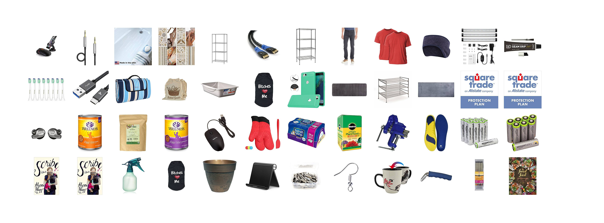

# amazon-orders-collage

Creates a collage (grid) of product images for each product in an amazon.com order history report.  

## How to use

- Clone this repo
- Install Dependencies `npm install`
- Get an [order history report](https://www.amazon.com/gp/b2b/reports) from your Amazon account
- Create a directory `/data` and save your order history report csv in it

- Download product images
  - `node get-photos.js {path-to-your-csv}` (`node get-photos.js data/order-history.csv`)
  - images will be saved in `/tmp`

- Assemble your collage!
  - `node assemble-collage`
  - Your collage will be saved in `/output/amazon-collage.jpg`

## Customizing Dimensions

You can customize the following layout properties in `assemble-collage.js`:

- `gridWidth` - the number of columns in the collage
- `cellPadding` - the padding around each product image (pixels)
- `imageDimension` - the dimensions (square) of the product images
- `outputPadding` - the padding around the outside of the collage (pixels)

## How it works

`get-photos.js` parses the csv, pulling the `ASIN/ISBN` value for each product.  It then GETs the product's page from amazon.com, parses the html with cheerio, grabs the first product image and saves it in `/tmp`

`assemble-collage.js` checks the number of images in `/tmp` and creates an empty white jpeg with dimensions that will fit all of the product images.  It then merges each product image with the collage, calculating the correct x/y position for each image.

## Contributors

[Chris Whong](https://github.com/chriswhong)
[Aidan Feldman](https://github.com/afeld)
